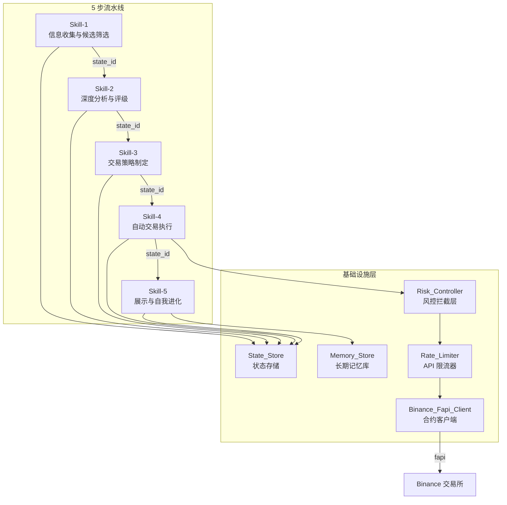
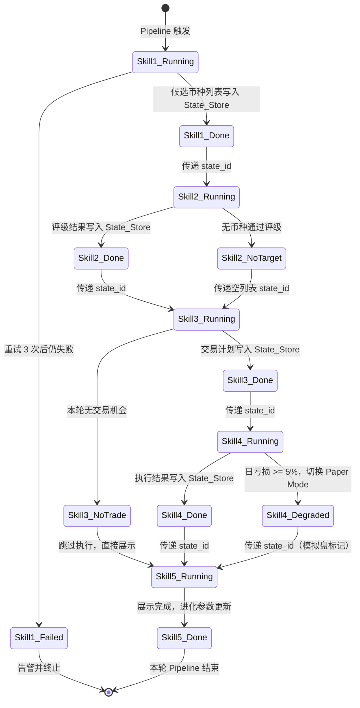
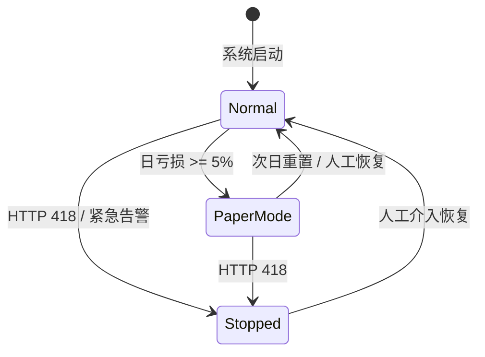

# 技术设计文档：OpenClaw Binance 交易 Agent

## 概述

本设计文档描述基于 OpenClaw 框架的加密货币自动化交易 Agent 系统的技术架构。系统采用 5 步流水线（Pipeline）Skill 架构，通过状态 ID 驱动的轻量化上下文传递机制，实现从市场信息收集到策略自我进化的完整交易闭环。

核心设计决策：
- **状态 ID 指针模式**：各 Skill 间仅传递 UUID v4 状态 ID，全量数据存储于 State_Store，避免 LLM 上下文窗口膨胀
- **硬编码风控拦截层**：Risk_Controller 作为独立物理隔离层，所有交易指令必须通过其断言校验才能到达 Binance API
- **防幻觉约束**：Skill-1 强制要求所有数据来源于外部真实市场渠道，禁止 Agent 生成未经验证的信息
- **优雅降级**：日亏损触及 5% 阈值时自动切换至 Paper_Trading_Mode，保持数据收集能力

技术栈选型：
- 运行框架：OpenClaw（Python）
- 合约接口：Binance fapi（REST + WebSocket）
- 分析子模块：TradingAgents（https://github.com/TauricResearch/TradingAgents）
- 数据存储：SQLite（State_Store / Memory_Store 持久化）
- Schema 校验：jsonschema（draft-07）
- 限流：令牌桶算法（Token Bucket）
- 测试框架：pytest + hypothesis（属性测试）

## 架构

### 全局架构图



### 数据流状态机



### 项目目录结构

```
openclaw-binance-agent/
├── README.md
├── pyproject.toml
├── config/
│   ├── default.yaml              # 默认配置（风控阈值、API 参数等）
│   └── schemas/                  # JSON Schema 定义
│       ├── skill1_input.json
│       ├── skill1_output.json
│       ├── skill2_input.json
│       ├── skill2_output.json
│       ├── skill3_input.json
│       ├── skill3_output.json
│       ├── skill4_input.json
│       ├── skill4_output.json
│       ├── skill5_input.json
│       └── skill5_output.json
├── src/
│   ├── __init__.py
│   ├── agent.py                  # Agent 主入口与 Pipeline 编排
│   ├── skills/
│   │   ├── __init__.py
│   │   ├── base.py               # Skill 基类（Schema 校验、日志）
│   │   ├── skill1_collect.py     # 信息收集与候选筛选
│   │   ├── skill2_analyze.py     # 深度分析与评级
│   │   ├── skill3_strategy.py    # 交易策略制定
│   │   ├── skill4_execute.py     # 自动交易执行
│   │   └── skill5_evolve.py      # 展示与自我进化
│   ├── infra/
│   │   ├── __init__.py
│   │   ├── state_store.py        # State_Store 实现
│   │   ├── memory_store.py       # Memory_Store 实现
│   │   ├── risk_controller.py    # Risk_Controller 风控拦截层
│   │   ├── rate_limiter.py       # Rate_Limiter 令牌桶限流
│   │   └── binance_fapi.py       # Binance_Fapi_Client 封装
│   └── models/
│       ├── __init__.py
│       └── types.py              # 数据模型定义（dataclass / TypedDict）
├── tests/
│   ├── __init__.py
│   ├── test_state_store.py
│   ├── test_risk_controller.py
│   ├── test_rate_limiter.py
│   ├── test_skills.py
│   ├── test_schema_validation.py
│   └── test_properties.py       # 属性测试（hypothesis）
├── data/
│   ├── state_store.db            # SQLite 状态存储
│   └── memory_store.db           # SQLite 记忆存储
└── scripts/
    ├── run_pipeline.py           # 启动 Pipeline
    └── run_paper_mode.py         # 启动模拟盘模式
```


## 组件与接口

### 1. State_Store（状态存储）

State_Store 是全局状态管理的核心组件，负责为每次 Skill 输出生成唯一状态 ID 并持久化存储完整数据快照。

**接口定义：**

```python
class StateStore:
    def save(self, skill_name: str, data: dict) -> str:
        """
        存储 Skill 输出数据，返回 UUID v4 状态 ID。
        - 自动生成 state_id
        - 持久化 data 的完整 JSON 快照至 SQLite
        - 记录 skill_name、时间戳
        """
        ...

    def load(self, state_id: str) -> dict:
        """
        根据状态 ID 检索完整数据快照。
        - 若 state_id 不存在，抛出 StateNotFoundError
        """
        ...

    def get_latest(self, skill_name: str) -> tuple[str, dict]:
        """
        获取指定 Skill 最近一次成功输出的 (state_id, data)。
        - 用于故障恢复场景
        """
        ...
```

**SQLite 表结构：**

```sql
CREATE TABLE state_snapshots (
    state_id    TEXT PRIMARY KEY,   -- UUID v4
    skill_name  TEXT NOT NULL,
    data        TEXT NOT NULL,      -- JSON 序列化
    created_at  TEXT NOT NULL,      -- ISO 8601 时间戳
    status      TEXT NOT NULL DEFAULT 'success'  -- success / failed
);
CREATE INDEX idx_skill_created ON state_snapshots(skill_name, created_at DESC);
```

### 2. Memory_Store（长期记忆库）

Memory_Store 存储历史交易归因数据，支持策略自我进化的反思与调优。

**接口定义：**

```python
class MemoryStore:
    def record_trade(self, trade: TradeRecord) -> None:
        """存储一笔已平仓交易的核心数据。"""
        ...

    def get_recent_trades(self, limit: int = 50) -> list[TradeRecord]:
        """获取最近 N 笔交易记录，按平仓时间倒序。"""
        ...

    def compute_stats(self, trades: list[TradeRecord]) -> StrategyStats:
        """计算策略胜率和平均盈亏比。"""
        ...

    def save_reflection(self, reflection: ReflectionLog) -> None:
        """存储策略调优建议至反思日志。"""
        ...

    def get_latest_reflection(self) -> ReflectionLog | None:
        """获取最新的反思日志。"""
        ...
```

### 3. Risk_Controller（风控拦截层）

Risk_Controller 作为独立拦截层运行，所有交易指令在到达 Binance_Fapi_Client 之前必须通过其校验。

**接口定义：**

```python
class RiskController:
    # 硬编码常量（不可配置）
    MAX_SINGLE_MARGIN_RATIO = 0.20    # 单笔保证金 <= 总资金 20%
    MAX_SINGLE_COIN_RATIO = 0.30      # 单币累计持仓 <= 总资金 30%
    DAILY_LOSS_THRESHOLD = 0.05       # 日亏损阈值 5%
    STOP_LOSS_COOLDOWN_HOURS = 24     # 止损后同方向冷却期

    def validate_order(self, order: OrderRequest, account: AccountState) -> ValidationResult:
        """
        对单笔订单执行全部风控断言校验。
        返回 ValidationResult(passed=bool, reason=str)。
        任一断言失败即拒绝订单。
        """
        ...

    def check_daily_loss(self, account: AccountState) -> bool:
        """
        检查当日累计已实现亏损是否触及 5% 阈值。
        返回 True 表示需要降级。
        """
        ...

    def execute_degradation(self, account: AccountState) -> None:
        """
        执行降级流程：
        1. 取消所有未成交挂单
        2. 停止实盘下单
        3. 发出告警通知
        4. 切换至 Paper_Trading_Mode
        """
        ...

    def is_paper_mode(self) -> bool:
        """返回当前是否处于模拟盘模式。"""
        ...

    def record_stop_loss(self, symbol: str, direction: str) -> None:
        """记录某币种某方向的止损事件，启动 24 小时冷却期。"""
        ...
```

**风控断言伪代码：**

```python
def validate_order(order, account):
    total_balance = account.total_balance
    
    # 断言 1：单笔保证金 <= 总资金 20%
    single_margin = order.quantity * order.price / order.leverage
    assert single_margin <= total_balance * 0.20, \
        f"单笔保证金 {single_margin} 超过限额 {total_balance * 0.20}"
    
    # 断言 2：单币累计持仓 <= 总资金 30%
    existing_position = account.get_position_value(order.symbol)
    new_total = existing_position + (order.quantity * order.price)
    assert new_total <= total_balance * 0.30, \
        f"单币累计持仓 {new_total} 超过限额 {total_balance * 0.30}"
    
    # 断言 3：止损后禁逆势补仓（24 小时冷却期）
    if is_in_cooldown(order.symbol, order.direction):
        reject(f"{order.symbol} {order.direction} 处于止损冷却期，禁止同方向开仓")
    
    return ValidationResult(passed=True)
```

**日亏损降级伪代码：**

```python
def check_and_degrade(account):
    daily_realized_loss = account.get_daily_realized_pnl()
    total_balance = account.total_balance
    loss_ratio = abs(daily_realized_loss) / total_balance
    
    if daily_realized_loss < 0 and loss_ratio >= 0.05:
        # 步骤 1：取消所有未成交挂单
        cancel_all_open_orders()
        
        # 步骤 2：停止实盘下单
        set_trading_enabled(False)
        
        # 步骤 3：发出告警通知
        send_alert(
            level="CRITICAL",
            message=f"日亏损达 {loss_ratio:.2%}，已触发 5% 阈值，系统降级至模拟盘"
        )
        
        # 步骤 4：切换至 Paper_Trading_Mode
        switch_to_paper_mode()
        
        log.warning(f"风控降级完成：日亏损 {loss_ratio:.2%}，当前模式=Paper_Trading")
```

### 4. Rate_Limiter（API 限流器）

基于令牌桶算法实现，确保 Binance fapi 请求频率不超过限制。

**接口定义：**

```python
class RateLimiter:
    NORMAL_RATE = 1000       # 正常速率：1000 次/分钟
    DEGRADED_RATE = 500      # 降级速率：500 次/分钟
    QUEUE_THRESHOLD = 800    # 队列阈值：超过 800 自动降速

    def acquire(self) -> None:
        """
        获取一个请求令牌。
        - 若令牌不足，阻塞等待直到可用
        - 队列超过 800 时自动降速至 500/min
        """
        ...

    def pause(self, seconds: int = 30) -> None:
        """暂停所有请求发送指定秒数（用于 HTTP 429 响应）。"""
        ...

    def stop(self) -> None:
        """立即停止所有请求（用于 HTTP 418 响应）。"""
        ...

    def get_queue_size(self) -> int:
        """返回当前待发送请求数量。"""
        ...
```

### 5. Binance_Fapi_Client（合约客户端）

封装 Binance U本位合约 fapi 接口，集成指数退避重试和超时控制。

**接口定义：**

```python
class BinanceFapiClient:
    REQUEST_TIMEOUT = 10  # 秒
    MAX_RETRIES = 5
    BACKOFF_SEQUENCE = [1, 2, 4, 8, 16]  # 指数退避序列（秒）

    def place_limit_order(self, symbol: str, side: str, price: float,
                          quantity: float) -> OrderResult:
        """提交限价订单。"""
        ...

    def place_market_order(self, symbol: str, side: str,
                           quantity: float) -> OrderResult:
        """提交市价订单（用于止损/止盈平仓）。"""
        ...

    def get_positions(self) -> list[PositionInfo]:
        """获取当前所有未平仓持仓。"""
        ...

    def get_account_info(self) -> AccountInfo:
        """获取账户余额和保证金信息。"""
        ...

    def cancel_all_orders(self, symbol: str = None) -> int:
        """取消指定币种或全部未成交订单，返回取消数量。"""
        ...

    def get_position_risk(self, symbol: str) -> PositionRisk:
        """获取指定币种的持仓风险信息（含未实现盈亏）。"""
        ...
```

**指数退避重试伪代码：**

```python
def request_with_retry(method, url, **kwargs):
    for attempt in range(MAX_RETRIES):
        try:
            response = http_request(method, url, timeout=10, **kwargs)
            
            if response.status == 429:
                rate_limiter.pause(30)
                continue
            
            if response.status == 418:
                rate_limiter.stop()
                send_alert(level="EMERGENCY", message="IP 被 Binance 封禁")
                raise IPBannedError()
            
            return response
            
        except TimeoutError:
            backoff = BACKOFF_SEQUENCE[min(attempt, len(BACKOFF_SEQUENCE) - 1)]
            log.warning(f"请求超时，第 {attempt+1} 次重试，等待 {backoff}s")
            sleep(backoff)
    
    # 重试耗尽
    send_alert(level="HIGH", message=f"API 请求 {url} 重试 {MAX_RETRIES} 次后仍失败")
    raise MaxRetryExceededError()
```

### 6. TradingAgents_Module（分析子模块）

封装对 TradingAgents 开源项目的调用接口。

**接口定义：**

```python
class TradingAgentsModule:
    ANALYSIS_TIMEOUT = 30  # 秒

    def analyze(self, symbol: str, market_data: dict) -> AnalysisResult:
        """
        对单个币种执行深度分析。
        - 超时 30 秒自动终止
        - 返回评级分、信号、置信度
        """
        ...
```

### 7. Skill 基类

所有 Skill 继承统一基类，内置 Schema 校验和日志记录。

```python
class BaseSkill:
    def __init__(self, state_store: StateStore, input_schema: dict, output_schema: dict):
        self.state_store = state_store
        self.input_schema = input_schema
        self.output_schema = output_schema

    def execute(self, input_state_id: str | None = None) -> str:
        """
        执行 Skill 的标准流程：
        1. 从 State_Store 加载输入数据（若有 input_state_id）
        2. 使用 input_schema 校验输入
        3. 调用 run() 执行业务逻辑
        4. 使用 output_schema 校验输出
        5. 将输出存入 State_Store，返回新的 state_id
        """
        start_time = now()
        log.info(f"[{self.name}] 开始执行, input_state_id={input_state_id}")
        
        # 加载并校验输入
        if input_state_id:
            input_data = self.state_store.load(input_state_id)
            validate(input_data, self.input_schema)  # 失败抛出 SchemaValidationError
        else:
            input_data = {}
        
        # 执行业务逻辑
        output_data = self.run(input_data)
        
        # 校验输出
        validate(output_data, self.output_schema)  # 失败标记为执行失败
        
        # 存储并返回状态 ID
        state_id = self.state_store.save(self.name, output_data)
        
        elapsed = now() - start_time
        log.info(f"[{self.name}] 执行完成, output_state_id={state_id}, 耗时={elapsed}s")
        return state_id

    def run(self, input_data: dict) -> dict:
        """子类实现具体业务逻辑。"""
        raise NotImplementedError
```


### Skill JSON Schema 定义

#### Skill-1：信息收集与候选筛选

**输入 Schema（skill1_input.json）：**

```json
{
  "$schema": "http://json-schema.org/draft-07/schema#",
  "title": "Skill1Input",
  "description": "Skill-1 信息收集触发输入",
  "type": "object",
  "properties": {
    "trigger_time": {
      "type": "string",
      "format": "date-time",
      "description": "Pipeline 触发时间（ISO 8601）"
    },
    "search_keywords": {
      "type": "array",
      "items": { "type": "string" },
      "minItems": 1,
      "description": "搜索关键词列表"
    }
  },
  "required": ["trigger_time", "search_keywords"],
  "additionalProperties": false
}
```

**输出 Schema（skill1_output.json）：**

```json
{
  "$schema": "http://json-schema.org/draft-07/schema#",
  "title": "Skill1Output",
  "description": "Skill-1 候选币种列表输出",
  "type": "object",
  "properties": {
    "state_id": {
      "type": "string",
      "format": "uuid",
      "description": "本次输出的状态 ID"
    },
    "candidates": {
      "type": "array",
      "items": {
        "type": "object",
        "properties": {
          "symbol": {
            "type": "string",
            "pattern": "^[A-Z]{2,10}USDT$",
            "description": "币种交易对符号（如 BTCUSDT）"
          },
          "heat_score": {
            "type": "number",
            "minimum": 0,
            "maximum": 100,
            "description": "市场热度评分（0-100）"
          },
          "source_url": {
            "type": "string",
            "format": "uri",
            "description": "数据来源 URL"
          },
          "collected_at": {
            "type": "string",
            "format": "date-time",
            "description": "采集时间戳"
          }
        },
        "required": ["symbol", "heat_score", "source_url", "collected_at"],
        "additionalProperties": false
      }
    },
    "pipeline_run_id": {
      "type": "string",
      "format": "uuid",
      "description": "本轮 Pipeline 运行 ID"
    }
  },
  "required": ["state_id", "candidates", "pipeline_run_id"],
  "additionalProperties": false
}
```

#### Skill-2：深度分析与评级

**输入 Schema（skill2_input.json）：**

```json
{
  "$schema": "http://json-schema.org/draft-07/schema#",
  "title": "Skill2Input",
  "description": "Skill-2 深度分析输入（状态 ID 引用）",
  "type": "object",
  "properties": {
    "input_state_id": {
      "type": "string",
      "format": "uuid",
      "description": "Skill-1 输出的状态 ID"
    }
  },
  "required": ["input_state_id"],
  "additionalProperties": false
}
```

**输出 Schema（skill2_output.json）：**

```json
{
  "$schema": "http://json-schema.org/draft-07/schema#",
  "title": "Skill2Output",
  "description": "Skill-2 评级结果输出",
  "type": "object",
  "properties": {
    "state_id": {
      "type": "string",
      "format": "uuid",
      "description": "本次输出的状态 ID"
    },
    "ratings": {
      "type": "array",
      "items": {
        "type": "object",
        "properties": {
          "symbol": {
            "type": "string",
            "pattern": "^[A-Z]{2,10}USDT$"
          },
          "rating_score": {
            "type": "integer",
            "minimum": 1,
            "maximum": 10,
            "description": "评级分（1-10）"
          },
          "signal": {
            "type": "string",
            "enum": ["long", "short", "hold"],
            "description": "多空或观望信号"
          },
          "confidence": {
            "type": "number",
            "minimum": 0,
            "maximum": 100,
            "description": "置信度百分比"
          }
        },
        "required": ["symbol", "rating_score", "signal", "confidence"],
        "additionalProperties": false
      }
    },
    "filtered_count": {
      "type": "integer",
      "minimum": 0,
      "description": "被过滤掉的低评级币种数量"
    }
  },
  "required": ["state_id", "ratings", "filtered_count"],
  "additionalProperties": false
}
```

#### Skill-3：交易策略制定

**输入 Schema（skill3_input.json）：**

```json
{
  "$schema": "http://json-schema.org/draft-07/schema#",
  "title": "Skill3Input",
  "description": "Skill-3 策略制定输入（状态 ID 引用）",
  "type": "object",
  "properties": {
    "input_state_id": {
      "type": "string",
      "format": "uuid",
      "description": "Skill-2 输出的状态 ID"
    }
  },
  "required": ["input_state_id"],
  "additionalProperties": false
}
```

**输出 Schema（skill3_output.json）：**

```json
{
  "$schema": "http://json-schema.org/draft-07/schema#",
  "title": "Skill3Output",
  "description": "Skill-3 交易计划输出",
  "type": "object",
  "properties": {
    "state_id": {
      "type": "string",
      "format": "uuid",
      "description": "本次输出的状态 ID"
    },
    "trade_plans": {
      "type": "array",
      "items": {
        "type": "object",
        "properties": {
          "symbol": {
            "type": "string",
            "pattern": "^[A-Z]{2,10}USDT$"
          },
          "direction": {
            "type": "string",
            "enum": ["long", "short"],
            "description": "交易方向"
          },
          "entry_price_upper": {
            "type": "number",
            "exclusiveMinimum": 0,
            "description": "入场价格区间上限"
          },
          "entry_price_lower": {
            "type": "number",
            "exclusiveMinimum": 0,
            "description": "入场价格区间下限"
          },
          "position_size_pct": {
            "type": "number",
            "exclusiveMinimum": 0,
            "maximum": 20,
            "description": "头寸规模百分比（不超过 20%）"
          },
          "stop_loss_price": {
            "type": "number",
            "exclusiveMinimum": 0,
            "description": "止损价格"
          },
          "take_profit_price": {
            "type": "number",
            "exclusiveMinimum": 0,
            "description": "止盈价格"
          },
          "max_hold_hours": {
            "type": "number",
            "exclusiveMinimum": 0,
            "description": "持仓时间上限（小时）"
          }
        },
        "required": [
          "symbol", "direction", "entry_price_upper", "entry_price_lower",
          "position_size_pct", "stop_loss_price", "take_profit_price", "max_hold_hours"
        ],
        "additionalProperties": false
      }
    },
    "pipeline_status": {
      "type": "string",
      "enum": ["has_trades", "no_opportunity"],
      "description": "本轮是否有交易机会"
    }
  },
  "required": ["state_id", "trade_plans", "pipeline_status"],
  "additionalProperties": false
}
```

#### Skill-4：自动交易执行

**输入 Schema（skill4_input.json）：**

```json
{
  "$schema": "http://json-schema.org/draft-07/schema#",
  "title": "Skill4Input",
  "description": "Skill-4 交易执行输入（状态 ID 引用）",
  "type": "object",
  "properties": {
    "input_state_id": {
      "type": "string",
      "format": "uuid",
      "description": "Skill-3 输出的状态 ID"
    }
  },
  "required": ["input_state_id"],
  "additionalProperties": false
}
```

**输出 Schema（skill4_output.json）：**

```json
{
  "$schema": "http://json-schema.org/draft-07/schema#",
  "title": "Skill4Output",
  "description": "Skill-4 交易执行结果输出",
  "type": "object",
  "properties": {
    "state_id": {
      "type": "string",
      "format": "uuid",
      "description": "本次输出的状态 ID"
    },
    "execution_results": {
      "type": "array",
      "items": {
        "type": "object",
        "properties": {
          "order_id": {
            "type": "string",
            "description": "Binance 订单 ID"
          },
          "symbol": {
            "type": "string",
            "pattern": "^[A-Z]{2,10}USDT$"
          },
          "direction": {
            "type": "string",
            "enum": ["long", "short"]
          },
          "executed_price": {
            "type": "number",
            "exclusiveMinimum": 0,
            "description": "成交价格"
          },
          "executed_quantity": {
            "type": "number",
            "exclusiveMinimum": 0,
            "description": "成交数量"
          },
          "fee": {
            "type": "number",
            "minimum": 0,
            "description": "手续费"
          },
          "status": {
            "type": "string",
            "enum": ["filled", "rejected_by_risk", "execution_failed", "paper_trade"],
            "description": "订单状态"
          },
          "executed_at": {
            "type": "string",
            "format": "date-time",
            "description": "成交时间戳"
          }
        },
        "required": [
          "order_id", "symbol", "direction", "status", "executed_at"
        ],
        "additionalProperties": false
      }
    },
    "is_paper_mode": {
      "type": "boolean",
      "description": "当前是否处于模拟盘模式"
    }
  },
  "required": ["state_id", "execution_results", "is_paper_mode"],
  "additionalProperties": false
}
```

#### Skill-5：展示与自我进化

**输入 Schema（skill5_input.json）：**

```json
{
  "$schema": "http://json-schema.org/draft-07/schema#",
  "title": "Skill5Input",
  "description": "Skill-5 展示与进化输入（状态 ID 引用）",
  "type": "object",
  "properties": {
    "input_state_id": {
      "type": "string",
      "format": "uuid",
      "description": "Skill-4 输出的状态 ID（可选，定时触发时为空）"
    }
  },
  "additionalProperties": false
}
```

**输出 Schema（skill5_output.json）：**

```json
{
  "$schema": "http://json-schema.org/draft-07/schema#",
  "title": "Skill5Output",
  "description": "Skill-5 展示与进化输出",
  "type": "object",
  "properties": {
    "state_id": {
      "type": "string",
      "format": "uuid"
    },
    "account_summary": {
      "type": "object",
      "properties": {
        "total_balance": { "type": "number", "minimum": 0 },
        "available_margin": { "type": "number", "minimum": 0 },
        "unrealized_pnl": { "type": "number" },
        "daily_realized_pnl": { "type": "number" },
        "is_paper_mode": { "type": "boolean" }
      },
      "required": ["total_balance", "available_margin", "unrealized_pnl", "daily_realized_pnl", "is_paper_mode"]
    },
    "positions": {
      "type": "array",
      "items": {
        "type": "object",
        "properties": {
          "symbol": { "type": "string" },
          "direction": { "type": "string", "enum": ["long", "short"] },
          "quantity": { "type": "number", "exclusiveMinimum": 0 },
          "entry_price": { "type": "number", "exclusiveMinimum": 0 },
          "current_price": { "type": "number", "exclusiveMinimum": 0 },
          "pnl_ratio": { "type": "number", "description": "盈亏比例（百分比）" }
        },
        "required": ["symbol", "direction", "quantity", "entry_price", "current_price", "pnl_ratio"]
      }
    },
    "evolution": {
      "type": "object",
      "properties": {
        "win_rate": { "type": "number", "minimum": 0, "maximum": 100 },
        "avg_pnl_ratio": { "type": "number" },
        "trade_count": { "type": "integer", "minimum": 0 },
        "adjustment_applied": { "type": "boolean" },
        "adjustment_detail": { "type": "string" }
      },
      "required": ["win_rate", "avg_pnl_ratio", "trade_count", "adjustment_applied"]
    }
  },
  "required": ["state_id", "account_summary", "positions", "evolution"],
  "additionalProperties": false
}
```


## 数据模型

### 核心数据类型

```python
from dataclasses import dataclass
from datetime import datetime
from enum import Enum

class TradeDirection(str, Enum):
    LONG = "long"
    SHORT = "short"

class Signal(str, Enum):
    LONG = "long"
    SHORT = "short"
    HOLD = "hold"

class OrderStatus(str, Enum):
    FILLED = "filled"
    REJECTED_BY_RISK = "rejected_by_risk"
    EXECUTION_FAILED = "execution_failed"
    PAPER_TRADE = "paper_trade"

class PipelineStatus(str, Enum):
    HAS_TRADES = "has_trades"
    NO_OPPORTUNITY = "no_opportunity"

@dataclass
class Candidate:
    """Skill-1 输出的候选币种"""
    symbol: str           # 如 "BTCUSDT"
    heat_score: float     # 0-100
    source_url: str
    collected_at: datetime

@dataclass
class Rating:
    """Skill-2 输出的评级结果"""
    symbol: str
    rating_score: int     # 1-10
    signal: Signal
    confidence: float     # 0-100

@dataclass
class TradePlan:
    """Skill-3 输出的交易计划"""
    symbol: str
    direction: TradeDirection
    entry_price_upper: float
    entry_price_lower: float
    position_size_pct: float   # 头寸规模百分比
    stop_loss_price: float
    take_profit_price: float
    max_hold_hours: float

@dataclass
class ExecutionResult:
    """Skill-4 输出的执行结果"""
    order_id: str
    symbol: str
    direction: TradeDirection
    executed_price: float
    executed_quantity: float
    fee: float
    status: OrderStatus
    executed_at: datetime

@dataclass
class TradeRecord:
    """Memory_Store 中的交易记录"""
    symbol: str
    direction: TradeDirection
    entry_price: float
    exit_price: float
    pnl_amount: float
    hold_duration_hours: float
    rating_score: int
    position_size_pct: float
    closed_at: datetime

@dataclass
class StrategyStats:
    """策略统计数据"""
    win_rate: float          # 胜率百分比
    avg_pnl_ratio: float     # 平均盈亏比
    total_trades: int
    winning_trades: int
    losing_trades: int

@dataclass
class ReflectionLog:
    """反思日志"""
    created_at: datetime
    win_rate: float
    avg_pnl_ratio: float
    suggested_rating_threshold: int    # 建议的评级过滤阈值
    suggested_risk_ratio: float        # 建议的风险比例
    reasoning: str                     # 调优推理过程

@dataclass
class AccountState:
    """账户状态"""
    total_balance: float
    available_margin: float
    daily_realized_pnl: float
    positions: list  # list[PositionInfo]
    is_paper_mode: bool

@dataclass
class OrderRequest:
    """订单请求"""
    symbol: str
    direction: TradeDirection
    price: float
    quantity: float
    leverage: int
    order_type: str  # "limit" | "market"

@dataclass
class ValidationResult:
    """风控校验结果"""
    passed: bool
    reason: str = ""
```

### 头寸规模计算算法

```python
def calculate_position_size(
    account_balance: float,
    risk_ratio: float,        # 账户风险比例（如 0.02 = 2%）
    entry_price: float,
    stop_loss_price: float
) -> float:
    """
    固定风险模型头寸规模计算。
    
    公式：头寸规模 = (账户风险比例 * 账户总资金) / |入场价格 - 止损价格|
    
    返回值：头寸数量（非百分比）
    """
    # 边界校验
    assert account_balance > 0, "账户余额必须为正数"
    assert 0 < risk_ratio <= 0.20, "风险比例必须在 (0, 0.20] 范围内"
    assert entry_price > 0, "入场价格必须为正数"
    assert stop_loss_price > 0, "止损价格必须为正数"
    assert entry_price != stop_loss_price, "入场价格不能等于止损价格"
    
    risk_amount = risk_ratio * account_balance
    price_distance = abs(entry_price - stop_loss_price)
    position_size = risk_amount / price_distance
    
    # 转换为头寸规模百分比
    position_value = position_size * entry_price
    position_pct = (position_value / account_balance) * 100
    
    # 风控上限裁剪：单笔不超过 20%
    if position_pct > 20.0:
        position_pct = 20.0
        position_size = (account_balance * 0.20) / entry_price
        log.info(f"头寸规模超限，已裁剪至 20%: {position_size}")
    
    return position_size
```

### 盈亏比例计算

```python
def calculate_pnl_ratio(entry_price: float, current_price: float,
                         direction: TradeDirection) -> float:
    """
    计算持仓盈亏比例（百分比）。
    
    做多：(当前价格 - 入场价格) / 入场价格 * 100
    做空：(入场价格 - 当前价格) / 入场价格 * 100
    """
    assert entry_price > 0, "入场价格必须为正数"
    assert current_price > 0, "当前价格必须为正数"
    
    if direction == TradeDirection.LONG:
        return ((current_price - entry_price) / entry_price) * 100
    else:
        return ((entry_price - current_price) / entry_price) * 100
```

### 进化评分与策略调优

```python
def compute_evolution_adjustment(trades: list[TradeRecord]) -> ReflectionLog | None:
    """
    基于最近 50 笔交易计算策略调优建议。
    
    规则：
    - 交易记录不足 10 笔时跳过，返回 None
    - 胜率低于 40% 时生成调优建议
    - 调优方向：提高评级过滤阈值、降低风险比例
    """
    if len(trades) < 10:
        return None
    
    recent = trades[:50]
    winning = [t for t in recent if t.pnl_amount > 0]
    win_rate = len(winning) / len(recent) * 100
    
    total_pnl = sum(t.pnl_amount for t in recent)
    avg_pnl_ratio = total_pnl / len(recent)
    
    if win_rate >= 40:
        return ReflectionLog(
            created_at=now(),
            win_rate=win_rate,
            avg_pnl_ratio=avg_pnl_ratio,
            suggested_rating_threshold=6,   # 维持默认
            suggested_risk_ratio=0.02,      # 维持默认
            reasoning="胜率正常，维持当前策略参数"
        )
    
    # 胜率低于 40%，需要调优
    # 策略：提高评级门槛（更严格筛选）+ 降低风险比例（更保守）
    new_threshold = min(8, 6 + int((40 - win_rate) / 10))
    new_risk_ratio = max(0.005, 0.02 * (win_rate / 40))
    
    return ReflectionLog(
        created_at=now(),
        win_rate=win_rate,
        avg_pnl_ratio=avg_pnl_ratio,
        suggested_rating_threshold=new_threshold,
        suggested_risk_ratio=round(new_risk_ratio, 4),
        reasoning=f"胜率 {win_rate:.1f}% 低于 40% 阈值，"
                  f"建议提高评级过滤阈值至 {new_threshold}，"
                  f"降低风险比例至 {new_risk_ratio:.4f}"
    )
```


## 正确性属性（Correctness Properties）

*正确性属性是系统在所有合法执行路径上都应保持为真的特征或行为——本质上是对系统应做之事的形式化陈述。属性是连接人类可读规格说明与机器可验证正确性保证之间的桥梁。*

### Property 1: State_Store 存取 round-trip

*对于任意* Skill 名称和任意合法的 JSON 数据对象，将其通过 `State_Store.save()` 存储后，使用返回的 `state_id` 调用 `State_Store.load()` 应当返回与原始数据完全一致的 JSON 对象，且 `state_id` 符合 UUID v4 格式。

**验证需求: Requirements 1.6, 2.1, 2.5, 3.1, 3.6, 4.1, 4.13, 5.1, 5.3, 6.1, 6.2**

### Property 2: Schema 校验通过——合法数据

*对于任意*符合 Skill 输入/输出 JSON Schema 定义的合法数据，使用对应的 Schema 进行校验应当通过，且 Skill 执行不会因 Schema 校验而中断。

**验证需求: Requirements 1.5, 2.3, 3.3, 9.2, 9.3**

### Property 3: Schema 校验拒绝——非法数据

*对于任意*不符合 Skill 输入 JSON Schema 定义的数据（缺少必填字段、类型错误、值越界），使用对应的 Schema 进行校验应当失败，且系统应拒绝执行并返回包含校验错误详情的错误响应。

**验证需求: Requirements 9.4, 9.5**

### Property 4: 数据来源标注完整性

*对于任意*经过 Skill-1 处理输出的候选币种记录，该记录必须包含非空的 `source_url`（合法 URI 格式）和非空的 `collected_at`（合法 ISO 8601 时间戳）字段。

**验证需求: Requirements 1.3**

### Property 5: 评级过滤阈值不变量

*对于任意*经过 Skill-2 过滤后输出的评级结果列表，列表中每个币种的 `rating_score` 必须大于等于当前评级过滤阈值（默认 6 分），且被过滤掉的币种数量等于原始列表中低于阈值的币种数量。

**验证需求: Requirements 2.4**

### Property 6: 头寸规模计算正确性

*对于任意*正数的账户余额、(0, 0.20] 范围内的风险比例、正数的入场价格和正数的止损价格（入场价格 ≠ 止损价格），头寸规模计算结果应满足：`position_size = (risk_ratio * balance) / |entry_price - stop_loss_price|`，且最终头寸价值不超过账户余额的 20%。

**验证需求: Requirements 3.2, 3.5**

### Property 7: 风控断言不变量

*对于任意*订单请求和账户状态，若订单通过 `Risk_Controller.validate_order()` 校验，则以下条件必须全部成立：(a) 单笔保证金 ≤ 总资金 × 20%，(b) 单币累计持仓 ≤ 总资金 × 30%，(c) 该币种该方向不在止损冷却期内。若任一条件不成立，订单必须被拒绝且返回包含拒绝原因的 `ValidationResult`。

**验证需求: Requirements 3.4, 4.2, 8.1, 8.2, 8.8**

### Property 8: 止损冷却期

*对于任意*币种和方向，在记录止损事件后的 24 小时内，该币种同方向的新开仓订单必须被 `Risk_Controller` 拒绝；超过 24 小时后，同方向订单应不再因冷却期被拒绝。

**验证需求: Requirements 8.3**

### Property 9: 日亏损降级触发

*对于任意*账户状态，当 `daily_realized_pnl` 为负且 `|daily_realized_pnl| / total_balance >= 0.05` 时，`Risk_Controller.check_daily_loss()` 必须返回 `True`，且执行降级后系统必须处于 `Paper_Trading_Mode`。

**验证需求: Requirements 4.11, 4.12, 8.5**

### Property 10: 平仓条件触发

*对于任意*持仓，当满足以下任一条件时，系统应发出平仓指令：(a) 未实现亏损触及止损价格，(b) 未实现盈利触及止盈价格，(c) 持仓时间超过 `max_hold_hours`。且平仓指令的类型为市价单。

**验证需求: Requirements 4.5, 4.6, 4.7**

### Property 11: 限流速率不变量

*对于任意*请求序列，在任意 60 秒滑动窗口内，通过 `Rate_Limiter` 发出的请求数量不超过当前速率上限（正常模式 1000 次/分钟，降速模式 500 次/分钟）。

**验证需求: Requirements 4.8, 7.1**

### Property 12: 限流自动降速

*对于任意*时刻，当 `Rate_Limiter` 的待发送请求队列长度超过 800 时，限流器的有效速率上限应自动降至 500 次/分钟；当队列长度降至 800 以下时，速率上限应恢复至 1000 次/分钟。

**验证需求: Requirements 7.2**

### Property 13: 指数退避序列正确性

*对于任意*连续失败的 API 请求序列，第 N 次重试（N 从 0 开始）的等待时间应为 `2^N` 秒，且序列为 [1, 2, 4, 8, 16] 秒，最多重试 5 次。

**验证需求: Requirements 7.6**

### Property 14: Paper Mode 行为一致性

*对于任意*处于 `Paper_Trading_Mode` 的系统状态，所有订单执行结果的 `status` 字段必须为 `paper_trade`，且 Skill-5 的展示输出中 `is_paper_mode` 必须为 `true`。

**验证需求: Requirements 8.6, 8.7**

### Property 15: 策略统计与调优触发

*对于任意*包含至少 10 笔交易记录的列表，胜率计算结果应等于 `盈利笔数 / 总笔数 × 100`；当胜率低于 40% 时，系统必须生成包含新评级阈值和新风险比例的调优建议，且新评级阈值 ≥ 默认阈值，新风险比例 ≤ 默认风险比例。

**验证需求: Requirements 5.4, 5.5, 5.6**

### Property 16: 数值参数边界校验

*对于任意*包含非正数价格或非正数头寸规模的交易计划输入，系统应拒绝该输入并抛出校验错误。

**验证需求: Requirements 3.8**

### Property 17: Pipeline 执行顺序不变量

*对于任意* Pipeline 执行记录，Skill 的执行时间戳必须严格满足 `Skill-1.end <= Skill-2.start <= Skill-2.end <= Skill-3.start <= ... <= Skill-5.end`，即前置 Skill 完成后才能启动后置 Skill。

**验证需求: Requirements 6.4**

### Property 18: 执行日志完整性

*对于任意* Skill 执行，系统必须在执行前后各记录一条日志，每条日志包含 `state_id`、`执行耗时`和`成功/失败状态`字段，且执行后日志的时间戳严格晚于执行前日志的时间戳。

**验证需求: Requirements 6.6**

### Property 19: 盈亏比例计算正确性

*对于任意*正数的入场价格和正数的当前价格，做多方向的盈亏比例应等于 `(current - entry) / entry × 100`，做空方向的盈亏比例应等于 `(entry - current) / entry × 100`。

**验证需求: Requirements 5.2**


## 错误处理

### 错误分类与处理策略

| 错误类别 | 触发条件 | 处理策略 | 恢复方式 |
|---------|---------|---------|---------|
| Schema 校验失败 | 输入/输出数据不符合 JSON Schema | 拒绝执行，返回校验错误详情 | 修正数据后重新提交 |
| 外部服务超时 | websearch/xurl/TradingAgents 调用超时 | 记录日志，重试（最多 3 次，间隔 60s） | 重试成功则继续；耗尽则标记失败 |
| Binance API 超时 | fapi 请求超过 10 秒 | 指数退避重试（1/2/4/8/16s，最多 5 次） | 重试成功则继续；耗尽则标记执行失败 |
| HTTP 429 限流 | Binance 返回 429 | Rate_Limiter 暂停 30 秒后恢复 | 自动恢复 |
| HTTP 418 封禁 | Binance 返回 418 | 立即停止所有 API 调用，紧急告警 | 需人工介入 |
| 风控断言失败 | 订单违反硬编码风控规则 | 拒绝订单，记录拒绝原因 | 无需恢复，属正常拦截 |
| 日亏损超限 | 当日已实现亏损 >= 总资金 5% | 取消挂单、停止实盘、切换 Paper Mode | 次日自动重置或人工恢复 |
| State_Store 读取失败 | state_id 不存在 | 抛出 StateNotFoundError | 从最后成功快照恢复 |
| Pipeline 崩溃 | 任意 Skill 执行中异常退出 | 记录崩溃点，保留最后成功 state_id | 从最后成功 state_id 恢复执行 |
| TradingAgents 单币种错误 | 分析子模块对某币种返回错误 | 跳过该币种，记录错误日志 | 继续处理剩余币种 |

### 告警级别定义

```python
class AlertLevel(str, Enum):
    INFO = "INFO"           # 一般信息（如 Skill 执行完成）
    WARNING = "WARNING"     # 警告（如重试中、头寸裁剪）
    HIGH = "HIGH"           # 高优先级（如 API 重试耗尽、订单执行失败）
    CRITICAL = "CRITICAL"   # 严重（如日亏损触发降级）
    EMERGENCY = "EMERGENCY" # 紧急（如 IP 被封禁）
```

### 降级状态转换



## 测试策略

### 双轨测试方法

本系统采用单元测试与属性测试（Property-Based Testing）相结合的双轨测试策略：

- **单元测试（pytest）**：验证具体示例、边界条件和错误处理路径
- **属性测试（hypothesis）**：验证跨所有输入的通用属性，每个属性测试至少运行 100 次迭代

两者互补：单元测试捕获具体 bug，属性测试验证通用正确性。

### 属性测试库选型

- **库**：hypothesis（Python 生态最成熟的属性测试库）
- **配置**：每个属性测试最少 100 次迭代（`@settings(max_examples=100)`）
- **标签格式**：每个测试用注释标注对应的设计属性
  - 格式：`# Feature: openclaw-binance-agent, Property {number}: {property_text}`

### 属性测试覆盖矩阵

| 属性编号 | 属性名称 | 测试文件 | 生成器策略 |
|---------|---------|---------|-----------|
| Property 1 | State_Store round-trip | test_properties.py | 随机 JSON 对象 + 随机 Skill 名称 |
| Property 2 | Schema 校验通过 | test_properties.py | 基于 Schema 生成合法数据 |
| Property 3 | Schema 校验拒绝 | test_properties.py | 基于 Schema 生成非法数据（缺字段/错类型） |
| Property 4 | 数据来源标注 | test_properties.py | 随机候选币种列表 |
| Property 5 | 评级过滤阈值 | test_properties.py | 随机评级分（1-10）列表 + 随机阈值 |
| Property 6 | 头寸规模计算 | test_properties.py | 随机正数余额/价格/风险比例 |
| Property 7 | 风控断言不变量 | test_properties.py | 随机订单请求 + 随机账户状态 |
| Property 8 | 止损冷却期 | test_properties.py | 随机币种/方向 + 随机时间偏移 |
| Property 9 | 日亏损降级 | test_properties.py | 随机账户余额 + 随机亏损金额 |
| Property 10 | 平仓条件触发 | test_properties.py | 随机持仓 + 随机当前价格/时间 |
| Property 11 | 限流速率不变量 | test_properties.py | 随机请求时间序列 |
| Property 12 | 限流自动降速 | test_properties.py | 随机队列长度序列 |
| Property 13 | 指数退避序列 | test_properties.py | 随机重试次数（0-4） |
| Property 14 | Paper Mode 行为 | test_properties.py | 随机订单 + Paper Mode 标志 |
| Property 15 | 策略统计与调优 | test_properties.py | 随机交易记录列表（>=10 笔） |
| Property 16 | 数值参数边界 | test_properties.py | 包含非正数的随机交易计划 |
| Property 17 | Pipeline 执行顺序 | test_properties.py | 随机 Skill 执行时间戳序列 |
| Property 18 | 执行日志完整性 | test_properties.py | 随机 Skill 执行记录 |
| Property 19 | 盈亏比例计算 | test_properties.py | 随机正数价格 + 随机方向 |

### 单元测试覆盖重点

单元测试聚焦于属性测试不易覆盖的场景：

- **边界条件**：重试耗尽（Skill-1 重试 3 次、API 重试 5 次）、空候选列表、交易记录不足 10 笔
- **特定 HTTP 响应**：429 暂停 30 秒、418 紧急停止
- **集成点**：websearch/xurl 调用链、TradingAgents_Module 超时处理
- **故障恢复**：Pipeline 崩溃后从最后成功 state_id 恢复
- **配置验证**：API 超时 10 秒、轮询间隔 30 秒

### 属性测试示例

```python
from hypothesis import given, settings, strategies as st

# Feature: openclaw-binance-agent, Property 6: 头寸规模计算正确性
@given(
    balance=st.floats(min_value=100, max_value=1e8, allow_nan=False, allow_infinity=False),
    risk_ratio=st.floats(min_value=0.001, max_value=0.20, allow_nan=False, allow_infinity=False),
    entry_price=st.floats(min_value=0.01, max_value=1e6, allow_nan=False, allow_infinity=False),
    stop_loss_price=st.floats(min_value=0.01, max_value=1e6, allow_nan=False, allow_infinity=False),
)
@settings(max_examples=100)
def test_position_size_calculation(balance, risk_ratio, entry_price, stop_loss_price):
    """头寸规模计算结果应符合公式且不超过 20% 上限。"""
    from hypothesis import assume
    assume(entry_price != stop_loss_price)
    
    size = calculate_position_size(balance, risk_ratio, entry_price, stop_loss_price)
    position_value = size * entry_price
    
    # 不变量：头寸价值不超过账户余额的 20%
    assert position_value <= balance * 0.20 + 1e-9  # 浮点容差

# Feature: openclaw-binance-agent, Property 7: 风控断言不变量
@given(
    margin_ratio=st.floats(min_value=0.0, max_value=0.5, allow_nan=False),
    coin_ratio=st.floats(min_value=0.0, max_value=0.6, allow_nan=False),
    in_cooldown=st.booleans(),
)
@settings(max_examples=100)
def test_risk_controller_invariant(margin_ratio, coin_ratio, in_cooldown):
    """风控校验通过的订单必须满足所有硬编码约束。"""
    result = mock_validate(margin_ratio, coin_ratio, in_cooldown)
    
    if result.passed:
        assert margin_ratio <= 0.20
        assert coin_ratio <= 0.30
        assert not in_cooldown

# Feature: openclaw-binance-agent, Property 19: 盈亏比例计算正确性
@given(
    entry=st.floats(min_value=0.01, max_value=1e6, allow_nan=False, allow_infinity=False),
    current=st.floats(min_value=0.01, max_value=1e6, allow_nan=False, allow_infinity=False),
    direction=st.sampled_from(["long", "short"]),
)
@settings(max_examples=100)
def test_pnl_ratio_calculation(entry, current, direction):
    """盈亏比例计算应符合公式定义。"""
    ratio = calculate_pnl_ratio(entry, current, TradeDirection(direction))
    
    if direction == "long":
        expected = ((current - entry) / entry) * 100
    else:
        expected = ((entry - current) / entry) * 100
    
    assert abs(ratio - expected) < 1e-9
```

